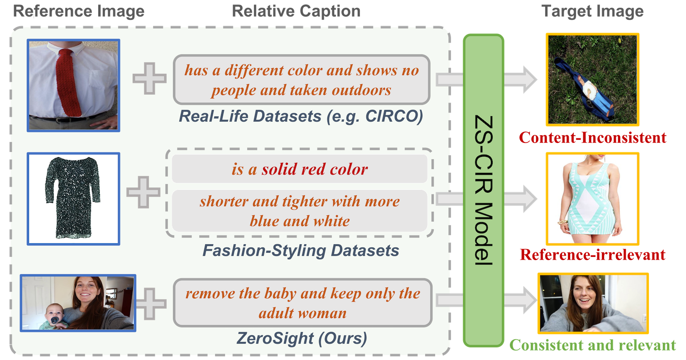
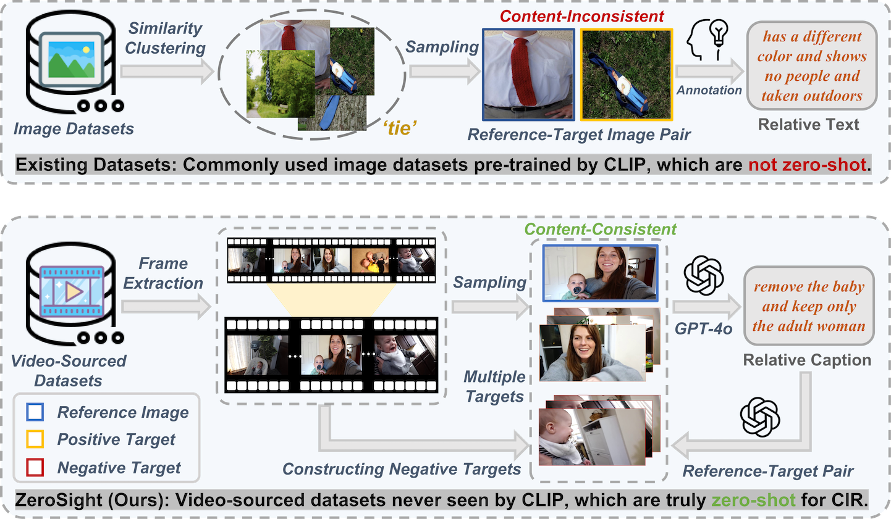
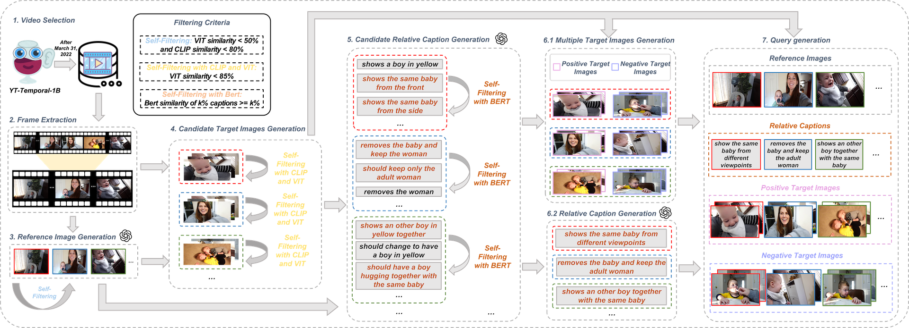
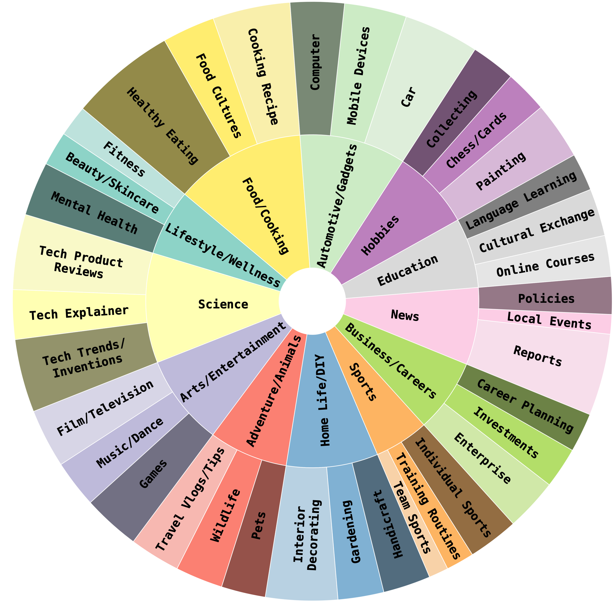
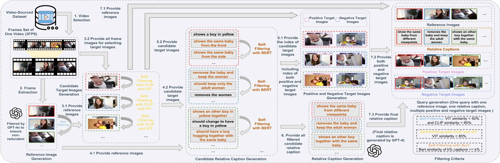
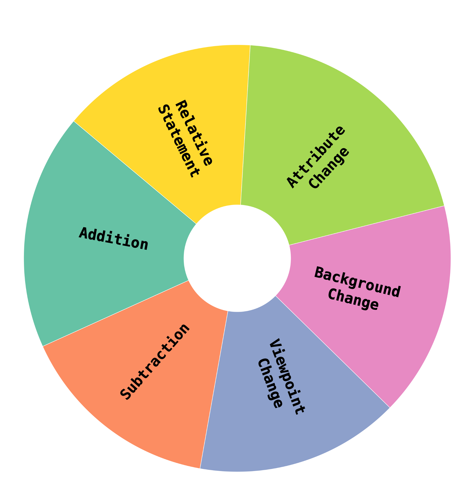
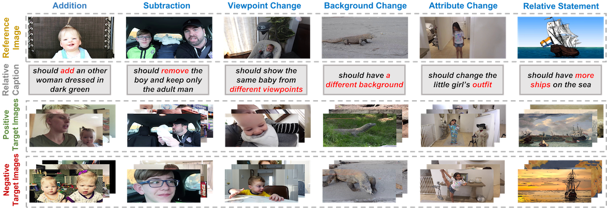

# **ZeroSight**

### **Never Seen Before: Benchmarking Genuine Zero-Shot Composed Image Retrieval with Consistent Video-Sourced Datasets**

This is the **code repository** of the paper "Never Seen Before: Benchmarking Genuine Zero-Shot Composed Image Retrieval with Consistent Video-Sourced Datasets".

## **Overview**
**Comparison of composed image retrieval among existing datasets.**


**Comparison of existing ZS-CIR dataset construction pipelines.**



**Overview of the proposed ZeroSight framework (Updated).**



### **Abstract**

Zero-Shot Composed Image Retrieval (ZS-CIR) has gained significant attention recently, aiming to retrieve a target image based on a query composed of a reference image and a relative caption without any training samples. Existing ZS-CIR datasets often suffer from inconsistencies between reference and target images due to noisy data sources, and they do not achieve a true zero-shot scenario as they use public image datasets that models like CLIP have been trained on. To tackle these challenges, we introduce ZeroSight, a novel benchmark for zero-shot composed image retrieval. It includes a dataset with consistent reference-target pairs sourced from videos, a data construction pipeline, and evaluation methods that consider the ranking of multiple positive and negative target images. We address the challenge of constructing visually and semantically consistent reference-target pairs by extracting frames from a single video and generating relative captions using LLM-assisted methods. To ensure a true zero-shot scenario, we use video data published after March 31, 2022, ensuring it was not included in CLIP's pre-training data. Our experimental results, obtained from 22 methods, reveal that the current ZS-CIR datasets and evaluation metrics result in inflated retrieval performance, exaggerating the capabilities of CIR methods. We expect ZeroSight to advance the research of ZS-CIR by providing a comprehensive and in-depth analysis of both current ZS-CIR and CIR methods. Our benchmark and experimental results can be accessed at https://anonymous.4open.science/r/ZeroSight-CFE1.

## **Getting Started**

### **Installation**

1. Clone the repository, click `Download file`
2. Install Python dependencies


```bash
conda create -n ZeroSight -y python=3.9.6
conda activate ZeroSight
conda install -y -c pytorch pytorch=1.11.0 torchvision=0.12.0
pip install transformers
pip install sentence-transformers
pip install git+https://github.com/openai/CLIP.git
```


### **Data Preparation**

#### **Directly download our filtered ZeroSight dataset (recommended):**

(1) Download ZeroSight dataset from Hugging Face (We will open source it after the review process is completed)::


```bash
git clone https://huggingface.co/XXX/ZeroSight
```


(2) Navigate to the dataset directory:


```bash
cd ZeroSight
```


(3) Concatenate the split files:

Use the cat command to concatenate all the split files into a single file. Assuming your split files are named from allVideos.part_aa to allVideos.part_ch, you can use the following command:


```bash
cat allVideos_tar_sep/allVideos.part_* > allVideo.tar.gz
```


(4) Verify the integrity of the file (optional):

Use the md5sum command to compute the checksum of the concatenated file and compare it with the provided checksum f5d08deb0d516c23caf8f1f6f0cda7d3:


```bash
md5sum allVideo.tar.gz
```


The output should look like this:


```bash
f5d08deb0d516c23caf8f1f6f0cda7d3  allVideo.tar.gz
```


If the checksum matches f5d08deb0d516c23caf8f1f6f0cda7d3, the file is intact and correct.

(5) Extract the concatenated file:

Use the tar command to extract the contents of allVideo.tar.gz:


```bash
tar -xzvf allVideo.tar.gz
```


After completing these steps, you should see the extracted video files in the current directory.


#### **Download from the official website:**

**YT-Temporal-1B**

Download the YT-Temporal-1B dataset following the instructions in the [**official web**](https://rowanzellers.com/merlotreserve/#data).

## **ZeroSight**

This section provides instructions for reproducing the queries of ZeroSigth.



### **Video Frame Extracting**

Video frame extraction can be directly run the following code. Run the following command:


```bash
python extract_video_frame/extract_video_frame_1s.py --data_dir allVideo --output_dir allVideo_frame
```


### **Generating Reference Images**

Run the following commands to obtain reference images. 

Firstly, run the following commands to get candidate reference images after gpt4o generation.


```bash
python generate_reference_images/filterReferImg_GPT4o.py --video_frame_folders_path /path_to_your_video_frame_folder --gpt4o_referImgs_files_path /path_to_save_candidate_reference_images_after_gpt4o
```


Then, run the following commands to get candidate reference images after ViT filtering.


```bash
python generate_reference_images/filterReferSmiImgs_ViT.py --gpt4o_referImgs_files_path /path_to_save_candidate_reference_images_after_gpt4o --vit_referImgs_files_path /path_to_save_candidate_reference_images_after_vit
```


Lastly, run the following commands to get final reference images.


```bash
python generate_reference_images/filterReferSmiImgs_CLIP.py  --vit_referImgs_files_path /path_to_save_candidate_reference_images_after_vit --referImgs_files_path /path_to_save_reference_images
```


### **Generating Multiple Target Images**

Run the following commands to obtain multiple target images. 

Firstly, run the following commands to get candidate target images after ViT filtering.


```bash
python generate_multiple_target_images/filterTargetImgs_VIT.py --video_frame_folders_path /path_to_your_video_frame_folder --referImgs_files_path /path_to_save_reference_images --vit_targetImgs_files_path /path_to_save_candidate_target_images_after_vit
```


Then, run the following commands to get candidate target images after CLIP filtering.


```bash
python generate_multiple_target_images/filterTargetImgs_CLIP.py --vit_targetImgs_files_path /path_to_save_candidate_target_images_after_vit --clip_targetImgs_files_path /path_to_save_candidate_target_images_after_clip
```


Lastly, run the following commands to get multiple target images.


```bash
python generate_multiple_target_images/filterTargetImgs_SELF.py  --clip_targetImgs_files_path /path_to_save_candidate_target_images_after_clip --targetImgs_files_path /path_to_save_multiple_target_images
```


### **Generating Relative Captions**

Run the following commands to obtain relative captions. 

Firstly, run the following commands to get candidate relative captions after GPT4o generation.


```bash
python generate_relative_captions/generateRelativeCap_GPT4o.py --targetImgs_files_path /path_to_save_multiple_target_images --gpt4o_relativeCaptions_files_path /path_to_save_candidate_relative_captions_after_gpt4o
```


Then, run the following commands to get candidate relative captions after BERT filtering.


```bash
python generate_relative_captions/filterRelativeCap_Bert.py --gpt4o_relativeCaptions_files_path /path_to_save_candidate_relative_captions_after_gpt4o --bert_relativeCaptions_files_path /path_to_save_candidate_relative_captions_after_bert
```


Lastly, run the following commands to get final relative captions.


```bash
python generate_relative_captions/generateFinalRelativeCap.py  --bert_relativeCaptions_files_path /path_to_save_candidate_relative_captions_after_bert --relativeCaptions_files_path /path_to_save_relative_captions
```




### **Evaluation**

**Results Format**

If you are ready to use our PNR-mAP metric to evaluate your retrieval results, you should make sure that the results file is a JSON file where the keys are the query ids and the values are the lists of the top 50 retrieved images.

**Note that:**

- the results file must contain all the queries in our benchmark when evaluating ZS-CIR retrieval and queries in our test set when evaluating CIR retrieval;
- to limit the size of the results file, you must submit only the top 50 retrieved images for each query.

The results file should be formatted as the following example:


```bash
{
	"0": [
  	"/path/to/local/images/folder/9761.jpg",
    "/path/to/local/images/folder/4321.jpg",
    "/path/to/local/images/folder/5893.jpg",
    ...
    ],
    "1": [
    "/path/to/local/images/folder/10110.jpg",
    "/path/to/local/images/folder/2034.jpg",
    "/path/to/local/images/folder/5089.jpg",
    ...
    ],
    ...
    "799": [
    "/path/to/local/images/folder/3054.jpg",
    "/path/to/local/images/folder/7734.jpg",
    "/path/to/local/images/folder/1010.jpg",
    ...
    ],
}
```


Then, run the following commands to evaluate your ZS-CIR results or CIR results using mAP and PNR-mAP metrics.


```bash
python evaluate_results/evaluate.py --all_queries_file_path /path_to_all_queries --results_file_path /path_to_your_top-50_retrieval_results
```


When evaluating ZS-CIR retrieval results, 'all_queries_file_path' is the path of all queries in ZeroSight. 

When evaluating CIR retrieval results, 'all_queries_file_path' is the path of all queries in the test set of ZeroSight. 

## **Visualization**

Examples of our ZeroSight dataset. We divide all queries into six categories, including Addition, Subtraction, Viewpoint Change, Background Change, Attribute Change and Relative Statement. The words in relative captions, highlighted in red, indicate the core characteristic of the category to which the query belongs.


